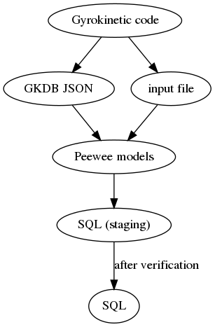

 # GKDB
Welcome! The GyroKinetic DataBase (GKDB) is a public accessable database of Gyrokinetic code output. Currently, [GKW](https://bitbucket.org/gkw/gkw/wiki/Home), [GENE](http://genecode.org/) and [QuaLiKiz](http://qualikiz.com) results are being incorporated, but we hope that more codes will be added in the future. The GKDB is being developed in the [EUROfusion](https://www.euro-fusion.org/) Enabling Research Project: *Realtime capable first principle transport modelling for tokamak prediction and control*. This project aims to provide an accurate and realtime-capable transport model for tokamak temperature, density, and rotation velocity prediction.

The database is temporarly hosted on [gkdb.qualikiz.com](http://gkdb.qualikiz.com/?pgsql=localhost&db=gkdb) and managed by [Karel van de Plassche](https://github.com/Karel-van-de-Plassche). Please send an [email](mailto:k.l.vandeplassche@differ.nl) if you need access. If you use this code or database results in a publication, please first send an [email](mailto:j.citrin@differ.nl) to the project officer [Jonathan Citrin](https://github.com/jcitrin) so the appropriate references can be agreed upon.

## Quickstart
1. Clone the repository (assuming you have [SSH keys set up](https://help.github.com/articles/connecting-to-github-with-ssh/))

  ```bash
  git clone git@github.com:gkdb/gkdb.git
  cd gkdb
  ```

2. Set up PostgreSQL username and password

  ```bash
  echo gkdb.qualikiz.com:*:*:$(username):$(password) > ~/.pgpass
  chmod 600 ~/.pgpass
  ```

Assuming you have read access to the `develop` schema in the `gkdb` database, you can now look inside. See the [Peewee Quickstart](http://docs.peewee-orm.com/en/latest/peewee/quickstart.html) for examples. For example, in a (i)Python shell:

```python
from gkdb.core.model import *
for point in Point.select():
    print(point.id)
```

## Overview
### Uploading results
There are several steps in uploading results to the database.
They are roughly shown in the following figure.
First, you must provide the output data in the [GKDB JSON](doc/IO/gkdb_json.md) format.
You should also provide the input file for your code so we can extract the relevant parameters.
These are combined into a single `Point`, uploaded to the staging database and validated.
If all checks passed the `Point` will be added to the main database automatically.



### Querying the database
You can query the database with several different analysis tools.
The only requirement here is that they should support querying an SQL database.


## Disclaimer
This work has been carried out within the framework of the EUROfusion Consortium and has received funding from the Euratom research and training programme 2014-2018 under grant agreement No 633053. The views and opinions expressed herein do not necessarily reflect those of the European Commission.
